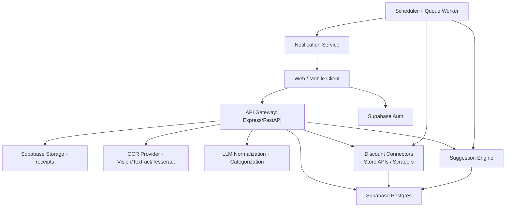

# AI Grocery Savings App Blueprint

## 1) Recommended Tech Stack

Current repository fit:
- Backend: Node.js + Express (already present)
- Database/Auth/Storage: Supabase (Postgres + Auth + Storage)
- AI extraction and reasoning: OpenAI (already present)
- Frontend web: current vanilla JS can remain, or migrate to React

Recommended production stack:
- Client apps:
  - Web: Next.js (React + server actions + SEO for landing pages)
  - Mobile: React Native with Expo (single codebase for iOS/Android)
- Backend API:
  - Option A (incremental from current code): Express + TypeScript
  - Option B (new service): FastAPI (Python) for OCR-heavy workflows
- Async jobs:
  - Queue: BullMQ (Redis) for receipt processing and discount scans
- Database and storage:
  - Supabase Postgres + Supabase Auth + Supabase Storage (receipt files)
- OCR and document AI:
  - Primary: Google Cloud Vision or AWS Textract for robust receipt OCR
  - Fallback: Tesseract OCR for low-cost/offline fallback
- LLM tasks:
  - OpenAI GPT-4.1 / GPT-4o for line-item normalization and categorization
  - Embeddings: text-embedding-3-large for product similarity and de-duplication
- Notifications:
  - Firebase Cloud Messaging (mobile push)
  - Email: Resend or SendGrid for weekly/monthly summaries
- Observability:
  - Sentry for backend and app error monitoring

## 2) High-Level Architecture



## 3) Core Flow

1. User uploads receipt image/PDF.
2. Backend stores original file in private storage bucket.
3. OCR extracts raw text/blocks.
4. LLM converts noisy text to structured JSON (store, date, items, qty, prices).
5. Normalization layer maps variant names to canonical products.
6. Data is saved to user-owned tables.
7. Weekly job builds usual grocery list and checks discounts.
8. Suggestion engine computes savings opportunities and pushes alerts/reports.

## 4) Recommended APIs/Libraries

Receipt ingestion and OCR:
- multer (already in repo) for upload handling
- pdf-parse for PDF text fallback
- sharp for image pre-processing (deskew/contrast)
- Google Cloud Vision client (`@google-cloud/vision`) or AWS Textract SDK

NLP and normalization:
- OpenAI SDK (`openai`) with structured outputs
- `fast-fuzzy` or `fuse.js` for local fuzzy matching against known products

Data and jobs:
- `@supabase/supabase-js`
- `bullmq` + `ioredis` for queues
- `node-cron` for scheduled discount scans and summaries

Discount discovery:
- Official APIs where possible (preferred)
- `axios` + `cheerio` for public pages with legal/robots compliance

## 5) Data Privacy and Security Plan

Authentication and authorization:
- Supabase Auth per user
- Row Level Security (RLS) enabled on all user data tables
- Every row includes `user_id`, policies enforce `auth.uid() = user_id`

Data protection:
- TLS in transit
- At-rest encryption handled by cloud providers
- Receipt files in private bucket, signed URLs with short TTL only
- Encrypt sensitive profile fields if needed (KMS-managed app keys)

Secrets and key handling:
- Store API keys in server environment only (never in client)
- Rotate keys every 90 days
- Separate dev/staging/prod projects and keys

Privacy and retention:
- Data minimization: only store required profile and purchase fields
- User controls for export/delete account data
- Configurable retention for raw OCR payloads and images
- Keep audit logs for data access and admin actions

Compliance guidance:
- Map flows for GDPR/CCPA readiness
- Add consent notice for receipt processing and personalization

## 6) Continuous Learning Strategy

Feedback loop:
- Let users correct parsed item names, quantities, categories, and prices.
- Save corrections to a `receipt_item_feedback` table.

Model improvement loop:
- Nightly job builds corrected training pairs from feedback.
- Update prompt examples and canonical product synonym dictionary.
- Re-score normalization quality (precision/recall) on a validation set.

Personalization loop:
- Track which suggestions users accept/reject.
- Increase recommendation weight for accepted suggestion types.
- Use family size + dietary constraints + preferred stores as ranking signals.

Safety loop:
- Track OCR confidence and LLM parse confidence.
- Route low-confidence receipts to "needs review" state in UI.

## 7) Suggested Project Structure

```text
backend/
  src/
    index.js
    routes/
      receipts.js
      users.js
      discounts.js
      suggestions.js
    services/
      ocr/
        receiptOcrService.js
      normalization/
        receiptNormalizationService.js
      weekly/
        weeklyListService.js
      discounts/
        discountSearchService.js
      suggestions/
        savingsSuggestionService.js
    workers/
      weeklyDigestWorker.js
      discountScanWorker.js
    repositories/
      receiptRepository.js
      profileRepository.js
      discountRepository.js
    lib/
      logger.js
      validation.js

frontend/
  src/
    app.js
    pages/
      dashboard/
      receipts/
      savings/

mobile/
  app/
    screens/
      ReceiptUploadScreen.tsx
      SavingsScreen.tsx
      HistoryScreen.tsx
```

## 8) Delivery Map in This Repository

The following starter files are added in this repo as concrete deliverables:
- `backend/src/examples/receiptExtractionExample.js`
- `backend/src/examples/weeklyListExample.js`
- `backend/src/examples/discountSearchExample.js`
- `backend/src/examples/savingsSuggestionsExample.js`
- `backend/sql/blueprint/schema_v2.sql`

These are implementation-focused examples you can adapt into routes/services.
